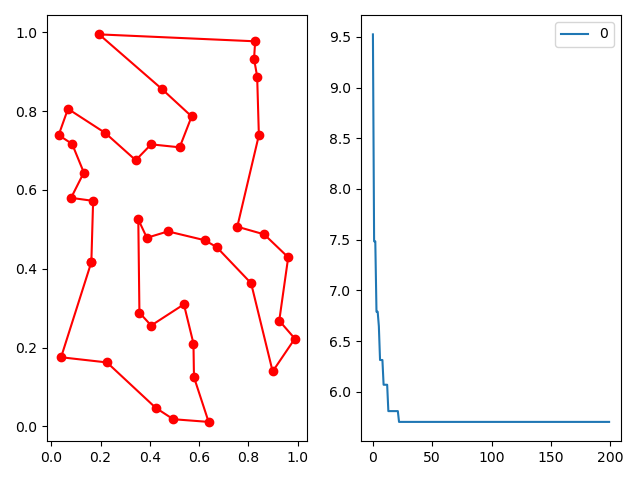

# 蚁群算法解决TSP问题
## TSP问题

* 假设有一个旅行商人要拜访n个城市，他必须选择所要走的路径，路径的限制是每个城市只能拜访一次，而且最后要回到原来出发的城市。路径的选择目标是要求得的路径路程为所有路径之中的最小值。
## 蚁群算法

* 蚂蚁在寻觅食物的道路上会留下信息素，而他们寻找食物的方向也是根据某个方向信息素的多少而决定的。也就意味着，当一个蚂蚁在某条路径上找到了食物，很快就会有其他蚂蚁也踏上这条路，释放更多的信息素，而较短的路径因为短，蚂蚁来回的速度快，信息素就会相对更多，聚集而来的蚂蚁就会越来越多，最后几乎所有的蚂蚁全部被集中在这条已知最短路径上。
#### 蚁周模型（ant cycle system）
* 在`ant cycle system`中，信息素释放计算公式为：`ΔPhe = Q / L(k)`。其中`ΔPhe`为蚂蚁循环一次释放的信息素总量，`L(k)`表示第k只蚂蚁经过的路径总长，根据此公式，实现了距离越远，信息素浓度越低，距离越短，信息素浓度越高。
## 蚁群算法解决TSP问题

#### 算法执行过程
* 初始化参数。
* 将蚂蚁随机的放在城市上。
* 蚂蚁各自按可能性矩阵选择下一座城市。
* 蚂蚁完成各自的周游。
* 更新信息素，进行下一次迭代。
#### 启发因子
* 将城市间距离倒数的矩阵作为启发因子，可能性矩阵的计算方法为：
```python
prob_matrix = (self.Phe ** self.alpha) * (self.prob_matrix_distance ** self.beta)
```
```
其中Phe 和 prob_matrix_distance 分别代表信息素矩阵和启发因子，alpha 和 beta 分别代表两者的重要程度
```
#### 选择下一座城市
* 根据可能性矩阵取出所有满足条件的候选城市的可能性，通过轮盘赌算法求出下一座城市
```python
prob = prob_matrix[self.PathTable[j, k], allow_list]
prob = prob / prob.sum()
next_point = np.random.choice(allow_list, size=1, p=prob)[0]
```
## 思考
* 如何处理局部最优情况 —— 轮盘赌算法 或 其他选择算法
* alpha beta 如何取值 —— 大量实验
* 模型对比 —— ant cycle、ant quantity、ant density